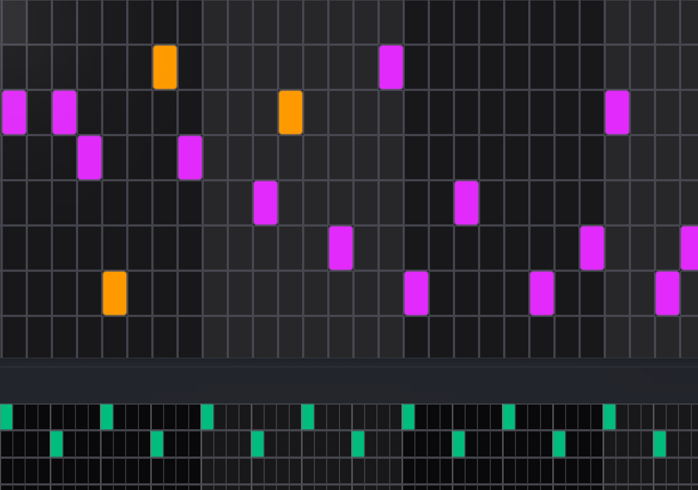

# Melodica

Melodica is a browser-based music sketchpad for capturing ideas fast: lay down melody, add drums, record vocals, and export your draft to MP3.



## Why Melodica

- Write and audition ideas directly in the browser
- Keep projects synced with Supabase-backed persistence
- Export sketches to MP3 without leaving the editor
- Attach album art so drafts feel like real releases

## Feature Highlights

- Google OAuth login/signup
- Dashboard for creating, loading, renaming, and deleting projects
- Multi-lane editor (melody + drums + vocals)
- MP3 export pipeline in the browser
- Album cover upload support

## Tech Stack

- Next.js 16 (App Router + TypeScript)
- React 19
- Tailwind CSS 4
- Tone.js
- Supabase (Auth, Postgres, Storage)

## Quickstart

1. Install dependencies.

```bash
npm install
```

2. Create `.env.local` in the project root.

```bash
NEXT_PUBLIC_SUPABASE_URL=https://<your-project-ref>.supabase.co
NEXT_PUBLIC_SUPABASE_ANON_KEY=<your-publishable-or-anon-key>

# Optional (defaults shown)
NEXT_PUBLIC_SUPABASE_COVER_BUCKET=album-covers
NEXT_PUBLIC_SUPABASE_AUDIO_BUCKET=audio-clips
```

3. Start the dev server.

```bash
npm run dev
```

4. Open `http://localhost:3000`.

## Supabase Setup

### Database

1. Run migrations from `supabase/migrations/`.
2. Confirm `public.songs` has RLS enabled.
3. Confirm ownership policies are active.

### Storage

Create private buckets:

- `album-covers`
- `audio-clips`

Add owner-only policies on `storage.objects` for each bucket:

- `select` where `owner = auth.uid()`
- `insert` where `owner = auth.uid()`
- `update` where `owner = auth.uid()`
- `delete` where `owner = auth.uid()`

## Deploying To Vercel

1. Import this repo into Vercel.
2. Use the `Next.js` framework preset.
3. Keep root directory as `./`.
4. Add environment variables:
   - `NEXT_PUBLIC_SUPABASE_URL`
   - `NEXT_PUBLIC_SUPABASE_ANON_KEY`
   - Optional bucket vars above
5. Deploy.

After first deploy, add your deployed URL to Supabase Auth settings:

- Site URL: `https://your-app.vercel.app`
- Redirect URLs: include both localhost and production URLs

## Current Access Model

- The app currently includes an owner-only gate in app logic.
- To support true multi-user usage, remove owner-email checks and update RLS/policies accordingly.
